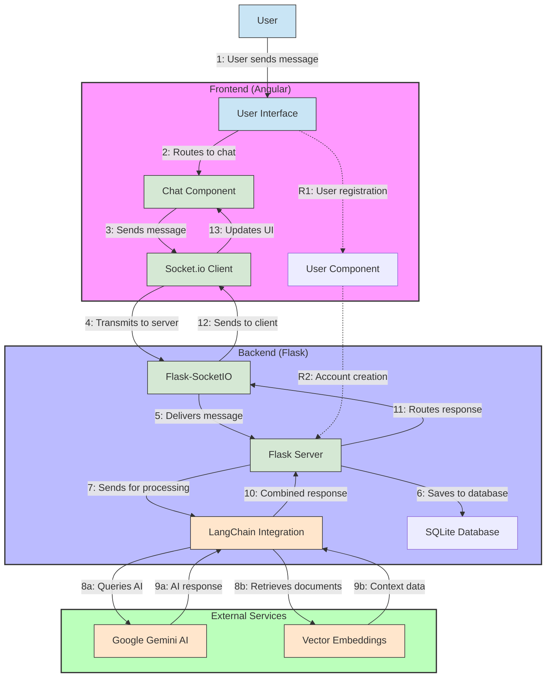

# Chatbot with Google Gemini

A full-stack chatbot application powered by Google's Gemini AI model with document retrieval capabilities. This project combines a Flask backend with an Angular frontend and supports embedding-based document retrieval for intelligent responses.

## 📑 Table of Contents

- [Chatbot with Google Gemini](#chatbot-with-google-gemini)
  - [📑 Table of Contents](#-table-of-contents)
  - [📋 Overview](#-overview)
  - [🏛️ Architecture Diagram](#️-architecture-diagram)
  - [✨ Features](#-features)
  - [🗂️ Project Structure](#️-project-structure)
  - [🚀 Setup Instructions](#-setup-instructions)
    - [Prerequisites](#prerequisites)
    - [Environment Variables](#environment-variables)
    - [Backend Setup](#backend-setup)
    - [Frontend Setup](#frontend-setup)
  - [🏃‍♂️ Running the Application](#️-running-the-application)
    - [Development Mode](#development-mode)
    - [Using Docker](#using-docker)
  - [💬 Using the Chatbot](#-using-the-chatbot)
  - [🔧 Technologies Used](#-technologies-used)
  - [🔮 Future Enhancements](#-future-enhancements)

## 📋 Overview

This project implements a chatbot application that leverages Google's Gemini AI model for natural language processing. It features document retrieval capabilities using LangChain's vector embeddings to provide context-aware responses based on provided documents.

## 🏛️ Architecture Diagram



## ✨ Features

- **AI-Powered Chatting**: Utilizes Google Gemini AI for intelligent, context-aware responses
- **Document Retrieval**: Uses LangChain and Chroma for embedding-based document retrieval
- **Real-time Communication**: Implements WebSockets via Flask-SocketIO for real-time chat
- **Modern Frontend**: Angular-based frontend with responsive design
- **Markdown Support**: Rich text formatting for chat messages
- **Docker Support**: Containerization for easy deployment
- **Database Integration**: SQLite database for storing users and messages

## 🗂️ Project Structure

```
chatbot_with_google_gemini/
├── backend/
│   ├── chatbot_helpers.py      # Helper functions for the chatbot
│   ├── docker_compose.yml      # Docker Compose configuration
│   ├── Dockerfile              # Docker configuration for the backend
│   ├── flask_app.py            # Main Flask application
│   ├── langchain_llm.py        # LangChain and LLM integration
│   ├── requirements.txt        # Python dependencies
│   └── embeddings/             # Storage for document embeddings
├── frontend/
│   └── chatbot-angular/        # Angular frontend application
│       ├── src/
│       │   └── app/
│       │       ├── chat/       # Chat component
│       │       └── user/       # User component
│       ├── package.json        # Node.js dependencies
│       └── angular.json        # Angular configuration
├── gemma/                      # Gemini model integration modules
└── test.py                     # Test script for Gemma model
```

## 🚀 Setup Instructions

### Prerequisites

- Python 3.11+
- Node.js 16+ and npm
- Google API key for Gemini
- Docker and Docker Compose (optional)

### Environment Variables

Create a `.env` file in the project root with:

```
GOOGLE_API_KEY=your_gemini_api_key
GOOGLE_LLM_MODEL_NAME=gemini-pro
GOOGLE_EMBEDDING_MODEL_NAME=models/embedding-001
```

### Backend Setup

1. Navigate to the backend directory:
   ```
   cd backend
   ```

2. Install required Python packages:
   ```
   pip install -r requirements.txt
   ```

### Frontend Setup

1. Navigate to the Angular frontend directory:
   ```
   cd frontend/chatbot-angular
   ```

2. Install Node.js dependencies:
   ```
   npm install
   ```

3. Build the Angular application:
   ```
   npm run build
   ```

## 🏃‍♂️ Running the Application

### Development Mode

1. Start the Flask backend:
   ```
   cd backend
   python flask_app.py
   ```
   You will be prompted to enter the embedding path (e.g., "./embeddings").

2. Start the Angular frontend:
   ```
   cd frontend/chatbot-angular
   ng serve --open
   ```

3. Access the application at `http://localhost:4200`.

### Using Docker

1. Start the Docker container:
   ```
   cd backend
   docker-compose up -d
   ```

2. Access the application at `http://localhost:5000`.

## 💬 Using the Chatbot

1. Enter your username when prompted.
2. Type messages in the chat input box and press send.
3. The chatbot will process your message using Google Gemini AI and respond accordingly.
4. If embedding-based document retrieval is enabled, the chatbot will use relevant documents to enhance responses.

## 🔧 Technologies Used

- **Backend**:
  - Flask (Python web framework)
  - Flask-SocketIO (WebSockets)
  - LangChain (LLM framework)
  - Google Gemini AI
  - SQLAlchemy (ORM)
  - Chroma (Vector database)

- **Frontend**:
  - Angular 17
  - Socket.io Client
  - markdown-it (Markdown rendering)
  - TypeScript

- **Deployment**:
  - Docker
  - Gunicorn with eventlet

## 🔮 Future Enhancements

- Voice interaction using text-to-speech (pyttsx3 integration is already present)
- Adding user authentication 
- Expanding supported document formats (PDF, Word, etc.)
- Implementing conversation history persistence
- Adding conversation topic categorization

---

This project showcases the integration of Google's Gemini AI model with document retrieval capabilities, providing a powerful foundation for building intelligent chatbot applications.
